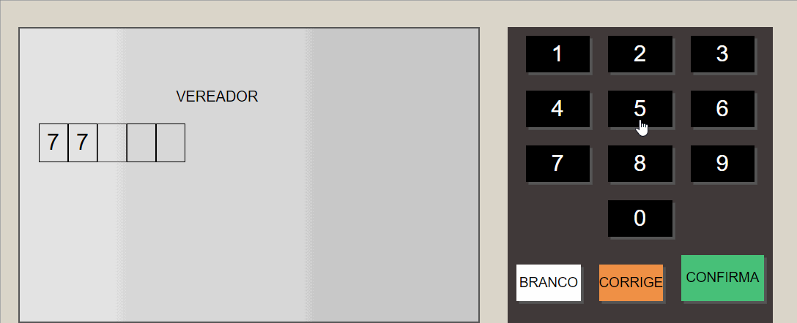

<h1 align="center">
Sistema similiar a urna eletronica em Javascript
</h1>
<h1>

</h1>

# Indice

- [Sobre](#-sobre)
- [Tecnologias Utilizadas](#-tecnologias-ultilizadas)
- [Como baixar o projeto](#-sobre)

## 🔥Sobre

O projeto **URNA** é um projeto baseado em uma Urna eletrônica, com o intuito de praticar JS.

---

## 💻Tecnologias Ultilizadas

O projeto foi desenvolvido com as seguintes tecnologias

- JavaScript
- HTML5
- CSS

## 🎮Como baixar o projeto

```bash

    # Clonar o repositório 
    $ git clone https://github.com/farpado/Urna.git

    # Instalar as dependências
    $ npm install

    # Iniciar o projeto 
    $ npm start

```

Feito com 💜 por Rodrigo Martins.